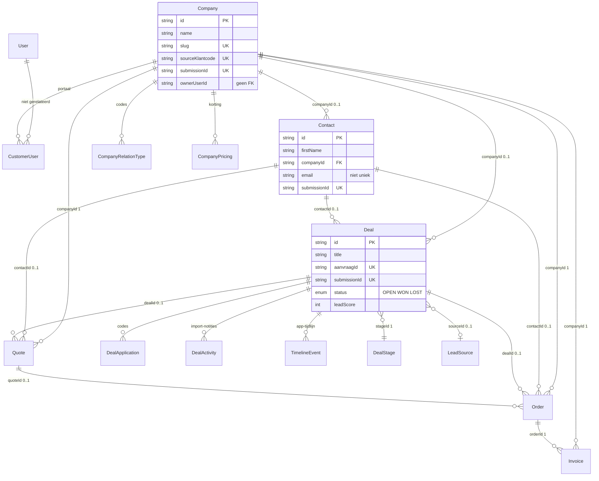
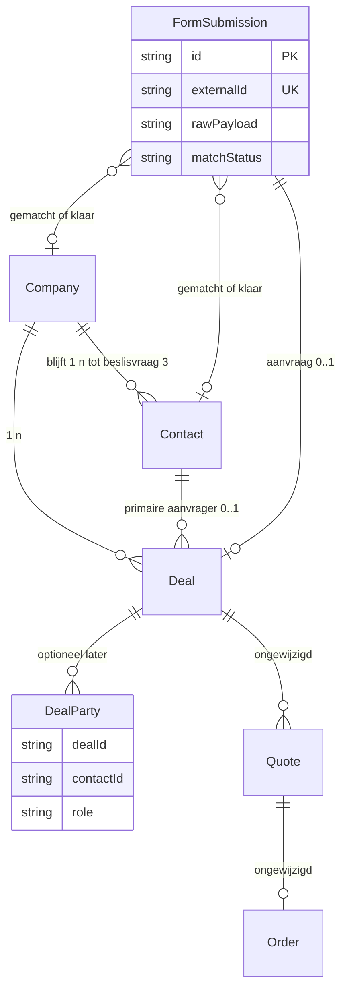

# CRM-datamodel inventarisatie — TRÔNE Seating

Datum: 16 september 2026  
Onderzoek: alleen-lezen audit van repository `trone` en database `trone_seating`  
Doel: vastleggen wat Bedrijf, Contact en Lead nu betekenen, waar gegevens wonen, hoe mutaties lopen, welke garanties bestaan, en wat de eerstvolgende ingreep moet zijn.

Niets in dit rapport is verzonnen. Conclusies zijn gelabeld:

- **GEVERIFIEERD** — bewezen in uitvoerbare code, migratie, of een uitgevoerde leesquery.
- **AFGELEID** — logische gevolgtrekking uit geverifieerd bewijs, zonder directe observatie van het gevolg.
- **ONBEKEND** — niet vastgesteld; ontbrekend bewijs is geen bewijs van juistheid.

Bewijs uit code en bewijs uit de draaiende database staan gescheiden. Dit rapport bevat geen credentials en geen herkenbare persoonsgegevens.

---

## 1. Managementsamenvatting

### Onderzoeksobject

Dit is de interne CRM-applicatie van TRÔNE Seating (`troneseating.app` / workspace `trone`). **GEVERIFIEERD** via `README.md`, `.cursor/rules/trone.md` en `docs/MVP.md`: single-tenant, `Company` is een klant (geen tenant), Next.js 16 + Prisma 7 + MariaDB SkySQL.

De commerciële keten die het model moet dragen is: inkomende interesse opvolgen tot verkoop, zonder dubbele identiteiten, tegenstrijdige gegevens, verloren historie of onbetrouwbare rapportages.

### Huidig CRM-uitgangspunt

Het fundament is een klassiek B2B-accountmodel, niet een Microsoft-achtige lead-kwalificatie vóór account-aanmaak:

| Begrip in de UI | Technische record | Feitelijke betekenis nu |
| --- | --- | --- |
| Bedrijf | `Company` | Commerciële klant/organisatie met één naam en één adresblok. Geen juridische entiteit, vestiging of groep als afzonderlijk type. |
| Contact | `Contact` | Persoon, optioneel gekoppeld aan hoogstens één bedrijf. Functie en “primair” liggen op de persoon, niet op een relatie. |
| Lead | `Deal` | Zowel aanvraag als verkoopkans: één pijplijnrecord van stage “Lead” tot “Gewonnen/Verloren”. Er is geen aparte Opportunity-tabel. |

**GEVERIFIEERD (database `trone_seating`, 16 sep 2026):** 658 bedrijven, 1.559 contacten, 1.292 leads. 1.267 leads komen uit bron `Contactformulier` en hebben een `aanvraagId` (CSV-import). 1.229 leads én 1.229 contacten hebben geen bedrijf. Alle 1.292 leads staan op status `OPEN`; 1.286 in stage “Lead”. 0 gewonnen, 0 verloren. 3 geaccepteerde offertes en 3 orders bestaan, zonder dat een lead op WON staat.

Het model **kan** een bedrijf en contact zelfstandig laten bestaan, en een lead zonder volledig bedrijf. In de praktijk is de dataset gesplitst: een relatief complete klantenlijst naast een grote, ongekwalificeerde stapel formulieraanvragen die niet aan die klanten hangen.

### Wat behouden kan blijven

Deze onderdelen zijn helder en nuttig:

- Single-tenant: CRM-bedrijf ≠ tenant. Interne `User` ≠ `CustomerUser`. **GEVERIFIEERD** (`docs/MVP.md` §1, `prisma/schema.prisma` regels 10–12, model `CustomerUser`).
- Stabiele interne UUID’s, unieke slugs, unieke importsleutels (`sourceKlantcode`, `aanvraagId`) en unieke `submissionId` per entiteit.
- Serverzijdige idempotentie bij herhaalde formulierindiening (`createWithSubmissionId` + unique index + `P2002`-retry).
- Afdwingbare regel: het contact van een lead/offerte moet bij hetzelfde bedrijf horen (`src/lib/contact-company.ts`).
- Leadscore met rijlock bij gelijktijdige kwalificatie (`setDealQualificationAnswer`).
- Offerte-configuratiesnapshot als bewuste historische kopie van prijs/keuzes.
- Gedocumenteerd uitbreidpunt voor contact↔bedrijf many-to-many (`docs/DATA-MODEL.md`).
- Gepagineerde lijsten (25) en kanban-kolommen (30).

### Vijf belangrijkste risico’s

1. **Identiteit van personen is niet geborgd.** E-mail is niet uniek, niet genormaliseerd tot lowercase, en wordt bij handmatige aanmaak niet gematcht. De import maakt per aanvraag een nieuw contact. **GEVERIFIEERD (DB):** 96 e-mailgroepen met meer dan één contact (224 rijen); 94 van die groepen zitten bij contacten zonder bedrijf. Dat zijn kandidaten, geen bewezen duplicaten.
2. **Klantenlijst en inkomende aanvragen zijn grotendeels ontkoppeld.** **GEVERIFIEERD (DB):** 601/658 bedrijven zonder lead, 1.229/1.292 leads zonder bedrijf, slechts 63 leads met bedrijf. Opvolging tot verkoop kan de aanvraag niet betrouwbaar aan de klant hangen.
3. **Geen samenvoegen, geen veldhistorie, last-write-wins.** Import overschrijft bestaande naam/e-mail/telefoon inclusief lege waarden. Twee gebruikers die hetzelfde bedrijf intypen maken twee records. Oude leads volgen live de actuele bedrijfsnaam.
4. **“Gewonnen” is geen verkoop.** WON is een handmatige stagevlag op `Deal`. Orders ontstaan alleen uit een geaccepteerde offerte. **GEVERIFIEERD (DB):** 3 geaccepteerde offertes, 3 orders, 0 WON-leads. Dashboard telt alle deals als “Leads” en pijplijnwaarde als som van `valueEstimate` op OPEN deals — nu grotendeels leeg (5 deals met schatting).
5. **Gelijktijdige aanmaak en onbegrensde leespaden schalen niet met de huidige voorraad.** Geen unique op KvK/btw/e-mail. `/kansen` laadt alle OPEN deals (nu 1.292) plus alle bedrijven. Leadlijst laadt alle bedrijven en contacten voor selects. Bij 10× (≈13k open leads) is dit een voorspelbaar knelpunt, nu al zwaar.

**Eerstvolgende ingreep met de meeste waarde:** identiteitsresolutie bij inname (match of menselijke beoordeling op persoon/bedrijf) plus een eenmalige, gecontroleerde koppeling van de 1.229 wees-aanvragen. Geen aparte Opportunity-tabel als eerste stap.

---

## 2. Definities, cardinaliteit en huidig ERD

### 2.1 Toets van de werkhypothesen

#### Bedrijf

| Vraag | Antwoord | Bewijs | Label |
| --- | --- | --- | --- |
| Zakelijke betekenis | Commerciële organisatie / klantaccount van TRÔNE. Niet tenant. | `.cursor/rules/trone.md` punt 1; schema-commentaar regels 10–12 | GEVERIFIEERD |
| Juridische entiteit vs vestiging vs handelsnaam vs groep | Eén record met `name` + één adresblok + optioneel KvK/btw. Die betekenissen lopen in één veld `name` door elkaar; er is geen vestigings- of holdingmodel. | `Company` in `prisma/schema.prisma` 108–153 | GEVERIFIEERD (structuur). Of gebruikers vestigingen als aparte bedrijven invoeren: ONBEKEND (geen PII-inspectie). |
| Technische representatie | Tabel `company` | Migratie `20260904080039_init`; live tabel aanwezig | GEVERIFIEERD |
| Aanmaakmoment | Handmatig, inline bij lead/offerte, composer (bedrijf+contact+optionele lead), CSV-import op `sourceKlantcode` | Services/actions/script hieronder | GEVERIFIEERD |
| Verplicht | Schema: `name`, `slug`, `country` (default NL), `vatRate` (default 21). App: naam verplicht. | schema + `companySchema` | GEVERIFIEERD |
| Eigenaar | Optioneel `ownerUserId` (geen FK naar `user`) | schema 128; INFORMATION_SCHEMA: geen FK | GEVERIFIEERD |
| Levenscyclus | Geen archiefvlag. Hard delete (admin), geblokkeerd bij offertes/orders/facturen. Contacten/leads worden bij delete op `companyId` NULL gezet (DB), niet meeverwijderd. | `deleteCompany` 535–561; FK `ON DELETE SET NULL` | GEVERIFIEERD |

#### Contact

| Vraag | Antwoord | Bewijs | Label |
| --- | --- | --- | --- |
| Zakelijke betekenis | Natuurlijk persoon | Model `Contact`; UI “Contacten” | GEVERIFIEERD |
| Werkgever | Eigenschap van de persoon (`companyId`), niet van een relatie. Hoogstens één bedrijf. | `Contact.companyId`; `docs/DATA-MODEL.md` | GEVERIFIEERD |
| Functie | Eigenschap van de persoon (`jobTitle`) | schema 172 | GEVERIFIEERD |
| Rol in een aankoop | Niet gemodelleerd. `isPrimary` is “hoofdcontact van het bedrijf”, geen rol op de lead. | schema 175; geen DealContact | GEVERIFIEERD |
| Verplicht | Schema: `firstName`, `slug`. App: voornaam. Bedrijf optioneel in schema; composer mag contact overslaan. | `contactSchema`; `parseOptionalComposerContactForm` | GEVERIFIEERD |
| Eigenaar | Optioneel `ownerUserId`, geen FK | schema 177 | GEVERIFIEERD |
| Levenscyclus | Hard delete (admin). Leads/offertes/orders krijgen `contactId` NULL via FK. | `deleteContact` 390–395; FK SET NULL | GEVERIFIEERD |

#### Lead

| Vraag | Antwoord | Bewijs | Label |
| --- | --- | --- | --- |
| Welke van de drie betekenissen? | **Verkoopkans + aanvraag in één record.** UI zegt “lead”; model heet `Deal`; `/kansen` is een leesview op OPEN deals. Stage 1 heet “Lead”. | schema `Deal`; `opportunity-service.ts`; seed stages | GEVERIFIEERD |
| Formulierinzending = leadrecord? | Bij CSV-import: ja, 1 `aanvraagId` → 1 `Deal`. Geen aparte submission-tabel. Live websitewebhook ontbreekt. | `scripts/import-schoon-csv.ts`; geen `webhook` in `src/` | GEVERIFIEERD |
| Meerdere inzendingen per lead? | Nee, behalve herimport van dezelfde `aanvraagId` (upsert). Een nieuwe inzending zonder dat id wordt een nieuwe lead. | import 562–607; `createDeal` zonder match op persoon | GEVERIFIEERD |
| Lead = opportunity? | Ja, hetzelfde record doorloopt de hele pijplijn. `/kansen` schrijft niet naar een ander model. | `opportunity-service.ts` 34–41 | GEVERIFIEERD |

### 2.2 Verplichte kernvragen

**Is een formulierinzending hetzelfde record als een lead?**  
Bij de bestaande import: ja (`aanvraagId` uniek op `deal`). Er is geen inzendingentabel. Activiteiten (bericht/interesse) landen als `DealActivity` NOTE, niet als tweede lead. **GEVERIFIEERD.**

**Kan één lead meerdere inzendingen of contactmomenten bevatten?**  
Contactmomenten: ja, via `TimelineEvent` (app) en historisch `DealActivity` (import). Extra formulierinzendingen: nee, die worden nieuwe leads tenzij hetzelfde `aanvraagId`/`submissionId` terugkomt. **GEVERIFIEERD.**

**Is de lead ook de verkoopkans? Werkt dat?**  
Ja, bewust. Voor TRÔNE’s korte B2B-cyclus (aanvraag → gesprek → offerte → demo → gewonnen) is één pijplijnrecord passend, **mits** identiteit en afsluiting kloppen. Aantoonbare conflicten nu:

- WON ≠ order ≠ factuur (**GEVERIFIEERD** in code en DB).
- Koopcomité past niet (één `contactId`).
- Herhaalde interesse van dezelfde persoon wordt een tweede persoon+lead, niet een tweede kans op hetzelfde contact (**GEVERIFIEERD** in import + ontbrekende e-mailmatch).
- Alle leads staan OPEN; conversierapportage is daardoor leeg.

Een aparte Opportunity-entiteit is **niet** de kleinste passende oplossing voor deze conflicten. Zie §6.

**Kunnen bedrijf en contact zelfstandig zonder lead?**  
Ja. Schema: geen verplichte `Deal`. **GEVERIFIEERD (DB):** 601 bedrijven zonder lead, 361 zonder contact.

**Kan een onvolledige aanvraag zonder fictieve personen/bedrijven?**  
Lead: `companyId` en `contactId` zijn optioneel. **GEVERIFIEERD.** Composer: bedrijfnaam is verplicht; contact mag volledig leeg blijven. Import: `contact_name` is verplicht, dus er wordt altijd een persoon aangemaakt; bedrijf alleen bij `matched_klantcode`. **GEVERIFIEERD.** Gevolg: 1.229 contacten zonder bedrijf — geen fictief bedrijf, wél een persoon per aanvraag.

**Kan een bedrijf meerdere contacten en meerdere leads hebben?**  
Ja, 1:n, geen unieke limiet. **GEVERIFIEERD (schema + DB):** 1 bedrijf heeft 7 gelijktijdig OPEN leads.

**Kan een persoon aan meerdere bedrijven, van werkgever wisselen, of namens een ander bedrijf handelen?**  
Nee in het model (1 `companyId`). Wisselen wordt geblokkeerd als de persoon aan een lead/offerte/order van een ander bedrijf hangt (`setContactCompany` 338–374). Namens een ander bedrijf handelen vereist óf het bedrijf van de lead wijzigen (contact moet meeverhuizen of worden losgekoppeld) óf een tweede contactrecord. **GEVERIFIEERD.**

**Kan een lead meerdere betrokken personen hebben (aanvrager/beslisser/inkoper)?**  
Nee. Eén `contactId`. Rol ligt nergens. Leadscorevraag “beslisser geïdentificeerd” is tekst op de deal, geen koppeling. **GEVERIFIEERD.**

**Hoe hangen bedrijf van lead, bedrijf van contact, en koop-/factuur-/leverpartij samen?**  
Er is één `companyId` per quote/order (verplicht) en optioneel per deal/contact. App eist gelijkheid als een contact gekozen is. Er zijn **geen** aparte factuur- of leverpartijen. Verschil deal.company vs quote.company is toegestaan als de deal geen bedrijf heeft (`assertQuoteRelations` weigert alleen als `deal.companyId` gezet is én afwijkt). **GEVERIFIEERD.** **DB:** 0 mismatches deal↔contact en quote↔deal waar beide gezet zijn. 10 offertes zonder deal; 3 orders zonder deal.

**Zijn CRM-bedrijf en applicatieorganisatie/tenant gescheiden?**  
Ja. Er is geen `organizationId`. TRÔNE is de enige tenant. `CustomerUser` (portaal, 0 rijen) is een login bij een CRM-bedrijf, geen tenant. **GEVERIFIEERD.**

### 2.3 Cardinaliteit (huidig)

| Relatie | Cardinaliteit | Optionaliteit | Afdwinging |
| --- | --- | --- | --- |
| Company → Contact | 1:n | Contact.companyId nullable | FK SET NULL bij company-delete |
| Company → Deal | 1:n | Deal.companyId nullable | FK SET NULL |
| Contact → Deal | 1:n | Deal.contactId nullable; max 1 contact per deal | FK SET NULL |
| Deal.contact ↔ Deal.company | 1:1 consistentie | Als contact gezet is, moeten company-id’s gelijk zijn (inclusief beide null) | Alleen applicatiecode, geen CHECK-constraint |
| Company → Quote/Order | 1:n | companyId verplicht | FK RESTRICT bij company-delete |
| Deal → Quote/Order | 1:n | dealId nullable | FK SET NULL bij deal-delete |
| Quote → Order | 1:0..1 | App: één order per offerte | App-check, geen unique op `order.quoteId` |
| Company → CompanyRelationType | 1:n | optioneel | PK (companyId, code), CASCADE |
| Deal → DealApplication | 1:n | optioneel | PK (dealId, code), CASCADE |
| User → eigenaarschap Company/Contact/Deal | losse string | optioneel | **geen FK** |

### 2.4 Huidig ERD



### 2.5 Vergelijking Microsoft / Salesforce (niet overnemen)

- Microsoft Dynamics kwalificeert een Lead tot Account + Contact + Opportunity. TRÔNE slaat de ongekwalificeerde tussenentiteit over en maakt meteen `Company`/`Contact`/`Deal` aan — behalve bij de formulierimport, die `Deal`+`Contact` zonder `Company` maakt.
- Salesforce ondersteunt één contact bij meerdere accounts. TRÔNE is bewust 1:1, met een gedocumenteerd uitbreidpunt. Dat uitbreidpunt is **niet** gebouwd; adviseurs en werkgeverwissel zijn daardoor niet correct modelleerbaar zonder duplicaat-contact.

---

## 3. Stack, opslag, velden en schrijfstromen

### 3.1 Stack en opslag buiten de database

**GEVERIFIEERD**

| Onderdeel | Gegeven |
| --- | --- |
| App | Next.js 16.3, React 19, TypeScript strict, App Router |
| ORM | Prisma 7.9, generator `prisma-client` → `src/generated/prisma` |
| Database | MariaDB **11.8.6-log**, database `trone_seating`, charset/collation `utf8mb4_unicode_ci` |
| Runtime | `@prisma/adapter-mariadb`, TLS, `connectionLimit: 5` (`src/lib/db.ts`) |
| Auth intern | Better Auth, tabellen `user` / `session` / `account` / `verification` |
| Auth klant | Model `CustomerUser` — 0 rijen, geen portaalroutes |
| Overige opslag | Vercel Blob voor productbeelden/avatars — geen CRM-identiteit |
| Documentatie vs code | `docs/STATUS.md` (4 sep 2026) is achterhaald (toen 7 migraties, nauwelijks CRM-data). `docs/DATA-MODEL.md` klopt voor de 1:1-regel. `docs/MVP.md` eist nog “gewonnen deal of geaccepteerde offerte → order”; code doet alleen geaccepteerde offerte. |

Migraties in de live database: 26 finished, inclusief `20260916100000_add_classification`. Die migratie staat in de working tree als untracked bestand; ze **is** wel toegepast. **GEVERIFIEERD.**

Prisma-schema vs live FK: `Contact.company` en `Deal.company`/`Deal.contact` hebben in het schema geen `onDelete`; de database heeft `SET NULL` (init-migratie). **GEVERIFIEERD.** Nieuwe migraties vanuit het schema kunnen dit per ongeluk willen wijzigen.

### 3.2 Veldinventarisatie — Company

Canonieke bron: rij in `company`. Schrijvers: `company-service`, CSV-import, VIES-update (`company-vat.ts` / `validateCompanyVat`).

| Veld | Type / null | Betekenis | Constraints | Soort gegeven | Gebruik |
| --- | --- | --- | --- | --- | --- |
| id | VARCHAR PK | Interne identiteit (`createId()` UUID) | PK | Actueel | Alle koppelingen |
| slug | VARCHAR unique | URL `/bedrijven/[slug]` | unique; herbouwd bij naamwijziging | Afgeleid van naam | Routing |
| sourceKlantcode | VARCHAR unique null | Importsleutel klantenbestand | unique | Externe ID | Alleen import |
| submissionId | VARCHAR unique null | Idempotente UI-aanmaak | unique UUID | Externe ID (app) | Create-forms |
| name | VARCHAR not null | Weergavenaam; juridisch/handelsnaam/vestiging niet onderscheiden | — | Actueel | Lijsten, leads, offertes |
| vatNumber | VARCHAR null | Btw-nummer | niet unique; wel genormaliseerd bij VIES-check | Actueel | VIES, btw-regime |
| cocNumber | VARCHAR null | KvK | niet unique | Actueel | Bedrijfsdetail |
| website | VARCHAR null | Vrije URL, geen domeinextractie | — | Actueel | Detail; DB: 4 gevuld |
| phone / email | VARCHAR null | Bedrijfskanaal; e-mail niet lowercased, niet unique | — | Actueel | Detail, zoek (naam, niet e-mail) |
| addressLine, postalCode, city, country | country default NL | Eén bezoek-/postadres | index city, country | Actueel | Filters, btw-land |
| vatRate | Decimal 21 | Standaard btw% | — | Actueel; quotes kopiëren eigen vatRate | Offertes |
| viesValidatedAt, viesValid, viesCheckedName | null | Laatste VIES-uitkomst | gewist bij wijziging btw/land | Cache van externe check | Detail |
| notes | TEXT null | Vrij | — | Actueel | Detail; migratiescript leest labels |
| ownerUserId | VARCHAR null | Verantwoordelijke medewerker | index; geen FK | Actueel | Filters, lijst |
| industryCode, sectorCode | VARCHAR null | Huidige branche/sector uit code-taxonomie | index | Actueel, geen historie | Filters leads/bedrijven/contacten |
| createdAt, updatedAt | DateTime | Prisma timestamps | — | Systeem | Sortering |
| relationTypes | koppeltabel | Eindgebruiker/dealer/OEM/… | PK (companyId, code), CASCADE | Actueel, full replace | Detail; DB: 0 rijen |

Lege waarde = SQL `null` of weggelaten optioneel veld. “Onbekend” in filters is `null`, niet een aparte sentinel. Bewust wissen via patch zet `null`. “Niet van toepassing” bestaat niet.

### 3.3 Veldinventarisatie — Contact

Canonieke bron: rij in `contact`. Schrijvers: `contact-service`, CSV-import (`upsertCompanyContact` / `upsertDealContact`).

| Veld | Type / null | Betekenis | Constraints | Soort gegeven | Gebruik |
| --- | --- | --- | --- | --- | --- |
| id | PK UUID | Interne identiteit | PK | Actueel | Koppelingen |
| slug | unique | URL `/contacten/[slug]` | unique; volgt naam | Afgeleid | Routing |
| submissionId | unique null | UI-idempotentie | unique | Externe ID | Create |
| companyId | FK null | Huidige werkgever | index; ON DELETE SET NULL | Actueel | Overal; blokkeert wissel bij gekoppelde docs |
| firstName | not null | Voornaam | — | Actueel | Identiteit, zoek |
| lastName | null | Achternaam | — | Actueel | Identiteit |
| jobTitle | null | Functie van de persoon | — | Actueel | Detail; DB: 3 gevuld |
| email | null | Niet unique, niet lowercase | — | Actueel | Zoek contains; geen match bij create |
| phone | null | Geen E.164 | — | Actueel | Detail; DB: 1.035 gevuld |
| isPrimary | bool default false | Hoogstens één primair per bedrijf (app, geen unique) | gewist als geen bedrijf | Actueel | UI; DB: 0 bedrijven met >1 primair |
| notes | TEXT null | Vrij | — | Actueel | Detail |
| ownerUserId | null, geen FK | Eigenaar | index | Actueel | Filters |
| createdAt, updatedAt | DateTime | Systeem | — | Systeem | — |

Import matcht binnen één bedrijf op genormaliseerde voor+achternaam (`upsertCompanyContact`). Leadimport matcht **niet** op e-mail: bij nieuwe `aanvraagId` altijd `contact.create`. **GEVERIFIEERD** (`import-schoon-csv.ts` 229–307).

### 3.4 Veldinventarisatie — Deal (Lead)

Canonieke bron: rij in `deal`. Status is afgeleid van stage (`isWon`/`isLost`). Schrijvers: `deal-service`, CSV-import, `syncDealValueFromQuotes`.

| Veld | Type / null | Betekenis | Constraints | Soort gegeven | Gebruik |
| --- | --- | --- | --- | --- | --- |
| id | PK | Interne identiteit | PK | Actueel | — |
| slug | unique | `/leads/[slug]` | unique uit title | Afgeleid | Routing |
| aanvraagId | unique null | Formulier-/importsleutel | unique | Externe ID | Import upsert |
| submissionId | unique null | UI-idempotentie | unique | Externe ID | Create |
| title | not null | Vrije titel; import = product + bedrijfsnaam | — | Actueel (import overschrijft) | Lijst, kanban |
| companyId / contactId | FK null | Huidige koppeling, geen snapshot van aanvraagpartij | SET NULL | Actueel | Detail, filters |
| stageId | FK verplicht | Pijplijnfase | RESTRICT op stage-delete | Actueel | Kanban |
| sourceId | FK null | Leadbron | SET NULL | Actueel | Filter; 1.267 Contactformulier |
| ownerUserId | null, geen FK | Eigenaar | index | Actueel | Filter |
| valueEstimate | Decimal null | Handmatige schatting **of** som actieve offertes | — | Hybride; offertes overschrijven | Dashboard (ruwe kolom), lijst (`effectiveDealValue`) |
| status | OPEN/WON/LOST | Kopie van stage-vlaggen | index | Afgeleid | Filter, dashboard OPEN |
| lostReason | VARCHAR null | Schema aanwezig | — | Ongebruikt | Geen write in service; DB: 0 |
| expectedClose | DATE null | Schema + filter/export | — | Ongebruikt als write | Filter `datumveld=verwacht`; DB: 0 |
| isHot | bool | Handmatige markering | — | Actueel | `/kansen`, toggle |
| qualFit…qualTiming | VARCHAR null | Antwoorden leadscore | — | Actueel | Kwalificatie-UI |
| leadScore, leadScoreAssessed, leadScoreNoMatch, leadScoreSort | afgeleid | Berekend uit antwoorden; max 100 | indexes | Cache van regels in `lead-score.ts` | Filter, kanban-sort; DB: 5 scored |
| applications | koppeltabel | Toepassing (heftruck, kraan, …) | CASCADE | Actueel op de deal | Filters; DB: 0 |
| createdAt | DateTime | Import zet deze op `created_at` van de CSV | index | Snapshot van aanvraagdatum bij import; anders inserttijd | Filters van/tot |

`DealActivity`: alleen nog geschreven door import (NOTE met prefix “Geïmporteerde aanvraag”). App schrijft `TimelineEvent`. **GEVERIFIEERD (DB):** 387 deal_activity vs 62 timeline_event.

### 3.5 Gegevens op meerdere plaatsen

| Gegeven | Plaatsen | Soort duplicatie | Leidend bij verschil |
| --- | --- | --- | --- |
| Bedrijfsnaam | `company.name`; soms in `deal.title` (composer/import) | Onbedoeld / titel als vrije tekst | Company.name voor identiteit; title is label |
| Contactnaam | `contact.*`; import note | Contact is canoniek | Contactrij |
| E-mail/telefoon | company én contact; import schrijft beide paden | Bedrijfskanaal vs persoon — bewust mogelijk, maar niet geëxpliciteerd | Geen regel; zoek op contact.email, niet op company.email |
| Branche/sector | alleen company; leadfilters joinen company | Actueel, geen historische classficatie op de deal | Company, live |
| Toepassing | `deal_application`; migratiescript leest ook title/notes | Actueel per deal | Junction |
| Dealwaarde | `deal.valueEstimate` vs som `quote.total` (DRAFT/SENT/ACCEPTED) | Nuttige afgeleide, maar **overschrijft** de schatting | Offertes winnen; `syncDealValueFromQuotes` schrijft null als er geen actieve offerte is (**AFGELEID:** handmatige schatting kan verdwijnen) |
| Btw | `company.vatRate` vs `quote.vatRate` / order | Snapshot op document | Document na vastleggen |
| Configuratie/prijs | catalogus vs `configSnapshot` JSON op quote/order | Bewuste historische kopie | Snapshot |
| Stage vs status | `deal_stage.isWon/isLost` vs `deal.status` | Afgeleide kopie | Stage; DB: 0 inconsistenties |
| Activiteiten | `deal_activity` vs `timeline_event` | Legacy vs actueel | Timeline in UI; import blijft op deal_activity |
| VIES-naam | `viesCheckedName` vs `company.name` | Cache externe bron | name is canoniek voor CRM; VIES is validatie |

### 3.6 Schrijfstromen

Algemeen patroon UI-create: FormData → Zod (`*-validation.ts`) → optioneel `submissionId`-lookup → Prisma create → koppeltabel replace → `revalidatePath`. Geen omvattende transactie behalve leadscore en CSV-import.

#### A. Handmatig bedrijf

`createCompanyAction` / `createCompanyInlineAction` → `parseCompanyForm` of `parseComposerCompanyForm` → `createCompany`. Match alleen `submissionId` + fingerprint naam/e-mail/telefoon/land. Geen match op KvK, btw, naam. **GEVERIFIEERD** `company-service.ts` 418–451.

#### B. Inline patch bedrijf

`patchCompanyAction` → `mergeCompanyPatch` → `updateCompany`. Last-write-wins (`updatedAt` wordt niet als versie gecheckt). Classificatie-patch eist `requireWritableSession`; overige velden alleen `requireSession`. **GEVERIFIEERD** `company-actions.ts`.

#### C. Handmatig contact

`createContactAction` → `createContact`. Match `submissionId` + voornaam/achternaam/`companyId` — **niet e-mail**. Primair-vlag demoteert anderen zonder transactie. **GEVERIFIEERD** `contact-service.ts` 242–282.

#### D. Contact van bedrijf wisselen

`setContactCompany`: weigert als deal/quote/order een ander `companyId` heeft. Geen historie van vorige werkgever. **GEVERIFIEERD** 338–387.

#### E. Handmatig lead

`createDealAction` / `createDealInlineAction` → `assertDealRelations` (contact mag company vullen) → create. Idempotentie: `submissionId` + `dealCreationMatches` (titel, company, contact, stage, source, waarde). Zelfde persoon + nieuwe `submissionId` = nieuwe lead. Getest in `deal-service-create.test.ts` (gemockte Prisma). **GEVERIFIEERD.**

#### F. Composer (bedrijf + optioneel contact + optionele lead)

`createComposerCustomerAction`: drie creates, **geen transactie**, zelfde `submissionId` op drie tabellen. Leadbron “Telefonisch” indien aangevinkt. Fout na bedrijf laat een bedrijf zonder contact/lead achter; retry is idempotent als de fingerprint klopt. **GEVERIFIEERD** `composer-customer-actions.ts` 56–116.

#### G. Stage / won / lost

`moveDealToStage` / `updateDeal`: `status = statusForStage(stage)`; `TimelineEvent` STAGE_CHANGE. Geen order, geen quote-status, `lostReason` wordt niet gezet. Heropenen = terug naar een niet-won/lost stage. **GEVERIFIEERD.**

#### H. Kwalificatie / leadscore

`patchDealQualificationAction` → `$transaction` + `SELECT … FOR UPDATE`. Antwoorden `""` / `unknown` / `__none__` → null (onbeoordeeld), onderscheiden van score 0. **GEVERIFIEERD** `lead-score.ts`, `deal-service.ts` 985–1037.

#### I. CSV-import (enige niet-UI massaschrijver)

`scripts/import-schoon-csv.ts`, `pnpm import:schoon-csv`. Geen app-route, geen webhook.

- Bedrijven: upsert `sourceKlantcode`. Lege CSV-velden → `null` → **overschrijven** van eerder gevulde velden. **GEVERIFIEERD** 408–427.
- Contact bij bedrijf: match naam binnen bedrijf; anders create.
- Leads: upsert `aanvraagId`. Contact: als de lead al een `contactId` heeft, **update** naam/e-mail/telefoon (ook naar null). Anders altijd create. Bron vast `Contactformulier`, stage `Lead`, status OPEN. Message/interest → `deal_activity` NOTE.
- Bestandsbrede `$transaction` (timeout 900s).

Er is **geen** inbound websiteformulier of webhook in `src/`. Seed bevat wel de bronnaam `Contactformulier`. **GEVERIFIEERD.**

#### J. Offerte / order (afhankelijk van CRM-rijen)

- Quote eist `companyId`; contact/deal optioneel met consistentiecheck (`assertQuoteRelations` 382–418).
- `syncDealValueFromQuotes` na create/edit/send/status.
- Order alleen vanuit `QuoteStatus.ACCEPTED`; kopieert company/contact/deal van de offerte. Unique-per-quote in app, niet in DB.
- WON-stage maakt geen order. **GEVERIFIEERD** `order-service.ts` 193–247 vs MVP §6.4.

#### K. Verwijderen / archiveren / mergen

- Delete: admin. Company geweigerd bij quote/order/invoice; contacten/leads niet geteld → DB zet hun `companyId` NULL. **AFGELEID:** delete van een bedrijf zonder factuurstukken weesmaakt leads.
- Archiveer: niet aanwezig.
- Merge: niet aanwezig voor CRM (wel voor `FeatureRequest`).

#### L. Achtergrond

Geen cron. `scripts/migrate-classification.ts` is een eenmalige, conservatieve backfill (dry-run mogelijk); overschrijft bestaande industry/sector niet. Niet als gemeten in deze audit gedraaid (zou schrijven).

---

## 4. Identiteit, concurrentie, historie, rapportage

### 4.1 Drie verschillende “dubbel”-problemen

| Probleem | Bestaande garantie | Beperking |
| --- | --- | --- |
| Dezelfde persoon/hetzelfde bedrijf twee keer opgeslagen | Geen unique op e-mail/btw/KvK/naam. Geen fuzzy match in de app. Import: unique `sourceKlantcode` / `aanvraagId`. | Twee UI-creates → twee rijen. Formulierimport → nieuw contact per aanvraag. |
| Dezelfde inzending twee keer verwerkt (dubbelklik, retry) | Client: `createSubmissionGuard`. Server: unique `submissionId` + lookup + `P2002` retry. Import: unique `aanvraagId`. | Uitgeschakelde knop alleen is onvoldoende; de unique index **is** servergarantie. Zonder `submissionId` (oude clients/scripts) geen bescherming. |
| Dezelfde persoon doet terecht een nieuwe aanvraag | Nieuwe `submissionId` / nieuw `aanvraagId` → nieuwe `Deal`. Getest (mock). | Werkt alleen als het **zelfde** contact hergebruikt wordt. Import doet dat niet; UI doet dat alleen als de gebruiker het bestaande contact kiest. |

E-mail unique maken zou gedeelde `info@`-mailboxen breken. **GEVERIFIEERD (DB):** 9 kandidaatgroepen op info@/admin@/office@/sales@/contact@/kantoor@ (18 rijen) — klein t.o.v. 96 e-mailgroepen totaal. Uniqueness op e-mail is zakelijk onjuist; matching + beoordeling is het juiste principe.

Normalisatie: trim; e-mail niet lowercase; telefoon niet E.164; btw wel (spaties/punten/streepjes weg, uppercase) bij VIES, originele invoer niet apart bewaard. **GEVERIFIEERD.**

Gelijktijdige creates zonder `submissionId`: beide inserts slagen. Gelijktijdige updates: last-write-wins. Uitzondering: leadscore FOR UPDATE. Slug-allocatie is check-then-insert zonder transactie: zeldzame `P2002` op slug mogelijk (**AFGELEID**).

### 4.2 Historie en statussen

Wat actueel móet blijven: bedrijfsnaam in de administratie, huidig adres, huidig btw-tarief voor nieuwe stukken, huidige eigenaar.

Wat de situatie bij aanvraag zou moeten vastleggen: wie vroeg aan, namens welk bedrijf, welke boodschap, welke bron, wanneer. Nu:

- Aanvraagtekst: import-NOTE op `deal_activity` (niet in de tijdlijn-UI).
- Partij: live FK’s. Hernoemen van het bedrijf verandert alle oude leads in de UI. Contact van werkgever laten wisselen is vaak geblokkeerd, waardoor gebruikers een tweede contact aanmaken (**AFGELEID**).
- Stageovergangen: `TimelineEvent`, geen immutable event sourcing van veldwaarden.
- Branche: alleen actueel op company; leadfilters gebruiken die live waarde. Historische sector van de aanvraag bestaat niet.

Levenscycli zijn wél gescheiden enum’s waar ze bestaan: `DealStatus`, `QuoteStatus`, `OrderStatus`, `InvoiceStatus`, `TaskStatus`. Ze zijn niet gekoppeld.

**WON** = stage “Gewonnen” (`isWon: true`) → `Deal.status = WON`. Bron: handmatige stagezetting. Geen afleiding uit order of betaling. Mollie/Invoice-appcode voor CRM-status ontbreekt (model bestaat; 2 facturen in DB, geen `mollie` in `src/` buiten schema).

Bestaande klant met nieuwe OPEN lead: schema staat het toe. **DB:** 0 WON, dus “klant + nieuwe lead” is niet via WON meetbaar; 1 bedrijf heeft 7 OPEN leads.

### 4.3 Rapportages

| Oppervlak | Eenheid | Risico |
| --- | --- | --- |
| `/overzicht` bedrijven | `company.count()` | Inclusief bedrijven zonder relatie tot verkoop |
| `/overzicht` leads | `deal.count()` alle statussen | 1.292 “leads”, bijna allemaal ongekwalificeerde imports in stage Lead |
| `/overzicht` pipeline | som `valueEstimate` OPEN | 5 gevulde schattingen; gebruikt **niet** `effectiveDealValue` |
| `/overzicht` orders | `order.count()` | 3; niet omzet |
| CSV-export leads | Deal-rijen, cap 5.000 | Waarde wél via `effectiveDealValue` — wijkt af van dashboard |
| `/kansen` | OPEN deals + alle companies | Unbounded; nu 1.292+658 |

Joins: deal-lijst aggregeert quotes in dezelfde query (`sumActiveQuoteTotals` in JS). Dashboard groepeert deals, geen Cartesian explosion. Een bedrijf met meerdere orders zou bij naïeve omzet-joins wel vermenigvuldigen; die rapportage bestaat nog niet. **GEVERIFIEERD** voor huidige queries; **AFGELEID** voor toekomstige omzetrapporten.

Branchefilters: actuele `company.industryCode` (nu overal null). Leadscore: regels in code; oude scores worden niet geversioned — betekenis wijzigt als punten in `LEAD_SCORE_QUESTIONS` veranderen zonder herberekening. **AFGELEID.**

---

## 5. Integriteit, autorisatie, schaal, tests, uitbreidbaarheid

### 5.1 Integriteit

**GEVERIFIEERD (INFORMATION_SCHEMA):** FK’s bestaan voor company/contact/deal/quote/order. Ontbrekend:

- `ownerUserId` op company/contact/deal → geen FK (0 wezen nu).
- `CustomerUser.contactId` → geen FK.
- Unique op `order.quoteId` ontbreekt.
- CHECK dat deal.contact.companyId = deal.companyId ontbreekt (0 schendingen nu).

Orphans: 1.229 contacten en 1.229 deals zonder bedrijf zijn geldig volgens schema, niet “gebroken FK”.

Cascade: company delete → SET NULL op contact/deal, RESTRICT op quote/order/invoice, CASCADE op relation types / pricing / customer_user. Deal delete → CASCADE applications + deal_activity; SET NULL op quotes/orders/timeline/tasks.

### 5.2 Autorisatie / tenant

Organisatiemodel: één TRÔNE-tenant. Interne sessie ziet alle CRM-rijen. Portaal (niet gebouwd) móet scopen op `customer_user.companyId`.

`viewer`: UI verbergt edit; de meeste create/update-actions gebruiken `requireSession()`, niet `requireWritableSession()`. Deletes: `requireAdmin`. Kwalificatie, timeline create, deal-applications, company-classificatie: writable. **GEVERIFIEERD.** Een viewer kan lead/bedrijf/contact/offerte muteren via de server action. **AFGELEID** tot een viewer-account dat daadwerkelijk zo’n action aanroept — de code staat het toe.

Export: `GET /leads/exporteren` na `requireSession` — hele gefilterde leadset, geen object-ACL.

### 5.3 Bewaar / privacy (geen complianceclaim)

Hard delete bestaat. Geen retentiepolicy in code. Import bewaart aanvraagtekst in `deal_activity`. Geen veld-auditlog. AVG-verwijdering van een persoon laat leads bestaan (contactId NULL) met titel/notitie. **AFGELEID.**

### 5.4 Prestaties

Gemeten volume: zie §8. Geen loadtest uitgevoerd.

| Pad | Gedrag nu | 10× (≈6,5k bedrijven, 15k contacten, 13k leads) |
| --- | --- | --- |
| Lijsten bedrijven/contacten/leads | pagina 25, indexes op filtervelden | Waarschijnlijk houdbaar |
| Kanban | 30/kolom; Lead-kolom heeft 1.286 rijen | Eerste pagina OK; “meer laden” nodig |
| CSV | cap 5.000; 1.292 nu | Bij 13k cap zichtbaar |
| `listCompaniesForSelect` / `listContactsForSelect()` zonder filter | **alle** rijen; leads-index laadt beide | 15k contacten in de leadpagina is een knelpunt |
| `listOpportunities` | alle OPEN deals + alle companies | **Nu al** 1.292 deals; 10× onhoudbaar zonder paging |
| `contains` zoek | `utf8mb4_unicode_ci`, leading wildcard | Geen fulltext; bij 10× trager, niet gemeten |
| Pool | 5 connecties serverless | Burst van kanban (7 queries) + selects |

N+1: kanban doet 7 parallelle `findMany`, geen per-rij queries. **GEVERIFIEERD.**

### 5.5 Tests vs databaseregels

Sterke unittests (gemockte Prisma of pure functies) voor: query-parsers, idempotent create, dealCreationMatches, contact-company, classification, leadscore, slug, VIES-parse, form guard.

**Niet** tegen MariaDB: unique races, FK SET NULL bij delete, import-overschrijf, composer-partial-write, e-mail-duplicaten. Engine-specifiek gedrag (collation, `FOR UPDATE`) is dus niet integratiegetest. **GEVERIFIEERD.**

### 5.6 Uitbreidbaarheid

| Behoefte | Huidige steun | Oordeel |
| --- | --- | --- |
| Meerdere contactrollen op een deal | Ontbreekt | Nodig zíjnde koopcomité; data toont bijna geen `jobTitle` (3) — behoefte nog dun |
| Vestigingen | Eén adresblok | Niet modelleren tot er echte multi-site cases zijn |
| Branche/sector | Gestructureerde codes + indexes; JSON onnodig | Behouden; vullen |
| Custom fields / scorevragen | Leadscore vast in code; classificatie vast in code | Code-taxonomie past bij één tenant; generiek veldmodel niet nodig |
| Nieuwe integratie (siteformulier) | `aanvraagId` / `submissionId` klaar; geen webhook | Eerst matchlaag, dan webhook |
| JSON | Juist op config-snapshot; onjuist voor identiteit | Niet uitbreiden naar CRM-kernvelden |

---

## 6. Scenarioanalyse (audittests van het model)

Geen muterende scenario’s uitgevoerd. “Aangetroffen” = wat code + schema + data afdwingen.

| # | Scenario | Verwacht (commercieel) | Aangetroffen | Bewijs | Tekortkoming |
| --- | --- | --- | --- | --- | --- |
| 1 | Nieuwe persoon, nieuw bedrijf, demo-aanvraag | 1 company, 1 contact, 1 deal, gekoppeld | UI/composer kan dit. Import zonder `matched_klantcode` maakt contact+deal zonder bedrijf. | composer-actions; import 501–509; DB 1.229 wezen | Match naar bedrijf ontbreekt bij inname |
| 2 | Bestaand contact, tweede inhoudelijke aanvraag | Zelfde contact, nieuwe deal | UI: ja als gebruiker het contact kiest. Import: nieuw contact. | `deal-service-create.test.ts`; import `contact.create` | Dubbele personen |
| 3 | Twee personen, één aankoop | Beide gekoppeld met rol | Eén `contactId` | schema Deal | Koopcomité onmogelijk |
| 4 | Twee verkooptrajecten, één bedrijf | Twee OPEN deals | Toegestaan; DB: 1 bedrijf met 7 OPEN deals | schema; query | Geen titel/regel die ze onderscheidt; alle in stage Lead |
| 5 | Contact wisselt van werkgever; oude aanvragen correct | Historie behoudt oud bedrijf | Live FK; wissel geblokkeerd bij gekoppelde docs | `setContactCompany`; geen snapshot | Of blokkade, of (als ontkoppeld) herschrijven van oude leads |
| 6 | Adviseur / meerdere bedrijven | Eén persoon, meerdere accounts | 1:1; tweede bedrijf = tweede contact | DATA-MODEL.md | Duplicaat-identiteit |
| 7 | Alleen bedrijfsnaam of alleen contact | Incomplete aanvraag bewaren | Lead mag beide missen; composer eist bedrijfsnaam; import eist contactnaam | schema; composer; import 487–490 | Geen “draft submission”-entiteit |
| 8 | Dubbele submit / herhaalde webhook | Eén record | UI: `submissionId`. Webhook: bestaat niet. Import: `aanvraagId`. | idempotent-create; grep webhook = 0 | Klaar voor UI; niet voor site-retry tot webhook idemepotent is |
| 9 | Twee gebruikers, zelfde bedrijf/contact tegelijk | Eén record of merge-wacht | Twee records | geen unique business key | Duplicaten |
| 10 | Import verouderd + gedeeld info@ | Niet overschrijven; info@ ≠ één persoon | Overschrijft inclusief leeg; info@ niet speciaal | import update; DB 9 shared-mailbox groepen | Dataverlies + verkeerde samenvoeging als men e-mail unique maakt |
| 11 | Merge duplicaten met behoud koppelingen | Merge-tool | Ontbreekt | geen merge-service | Handmatig onmogelijk zonder SQL |
| 12 | Nieuwe interesse na gewonnen/verloren | Beleid: heropen vs nieuwe deal | Geen beleid in code; heropen = stage terug; nieuwe deal altijd mogelijk. 0 WON/LOST om te toetsen. | moveDealToStage; DB | Beslisvraag, zie §10 |
| 13 | Meerdere offertes/orders; omzet/klanten tellen | Unieke klanten, geen verdubbeling | Geen omzetdashboard. Quote-som op deal telt meerdere actieve offertes bij elkaar (bewust). Order-from-quote 1:1 in app. | deal-value.ts; order-service | Toekomstige omzetqueries moeten op order/invoice groeperen, niet deal×quote joinen |

---

## 7. Meetbare datakwaliteit

**Onderzochte omgeving:** MariaDB 11.8.6, schema `trone_seating`, read-only aggregaties op 16 september 2026 via de lokale app-databaseverbinding (`.env.local`). Geen rijen met persoonsgegevens uitgelezen.

**Beperkingen:** duplicaatgroepen zijn kandidaten. Of `trone_seating` productie of een gedeelde live-omgeving is, volgt uit de verbinding; de naam en volumes wijzen op de echte CRM-dataset, niet op seed (seed maakt geen companies/deals).

| Controle | Definitie | Uitkomst | Label |
| --- | --- | --- | --- |
| Aantallen | COUNT(*) | company 658, contact 1.559, deal 1.292, quote 15, order 3, invoice 2, customer_user 0, timeline 62, deal_activity 387, task 8, deal_application 0, company_relation_type 0 | GEVERIFIEERD |
| Dealstatus | GROUP BY status | OPEN 1.292; WON 0; LOST 0 | GEVERIFIEERD |
| Stage | join deal_stage | Lead 1.286; overige open stages 6; Gewonnen/Verloren 0 | GEVERIFIEERD |
| Wees-relaties (nullable) | companyId/contactId IS NULL | 1.229 contacten zonder bedrijf; 1.229 deals zonder bedrijf; 12 deals zonder contact. Alle 1.229 wees-contacten hebben wél e-mail. | GEVERIFIEERD |
| Gebroken FK-consistentie app-regel | deal.company ≠ contact.company | 0 | GEVERIFIEERD |
| Quote/order vs deal company | mismatch waar deal.company gezet is | 0; wel 10 quotes zonder deal, 3 orders zonder deal | GEVERIFIEERD |
| Status vs stage-vlaggen | isWon/isLost vs DealStatus | 0 | GEVERIFIEERD |
| Dubbele bedrijfsnaam / btw / bedrijfse-mail | GROUP BY normalized, HAVING >1 | 0 groepen | GEVERIFIEERD (kandidaten: geen) |
| Dubbele contacte-mail | LOWER(TRIM(email)) | 96 groepen, 224 rijen; groottes 2 (75), 3 (15), 4 (4), 5 (1), 8 (1). 94 groepen op companyId NULL. 9 groepen shared-mailbox-patroon. | GEVERIFIEERD als kandidaten |
| Dubbele naam binnen bedrijf | companyId+voor+achter | 19 groepen, 42 rijen | GEVERIFIEERD als kandidaten |
| Importkoppeling | sourceKlantcode / aanvraagId | 629 bedrijven, 1.267 deals | GEVERIFIEERD |
| Bron | lead_source | Contactformulier 1.267; Google Ads 9 | GEVERIFIEERD |
| Ontbrekende stamdata | null/leeg | 633 bedrijven zonder e-mail; 657 zonder btw; 361 zonder contact; 601 zonder deal; website 4; jobTitle 3; valueEstimate 5; industry/sector 0 | GEVERIFIEERD |
| WON vs verkoop | WON ∩ accepted quote / order | 0 WON; 3 accepted quotes zonder WON-deal | GEVERIFIEERD |
| Eigenaar-wezen | ownerUserId niet in user | 0 | GEVERIFIEERD |
| Ongebruikte velden | expectedClose, lostReason | 0 gevuld | GEVERIFIEERD |
| Meer OPEN deals per bedrijf | HAVING COUNT>1 | 1 bedrijf, 7 deals | GEVERIFIEERD |
| Classificatie gevuld | industry/sector/applications/relations | 0 | GEVERIFIEERD |
| submissionId-gebruik (UI vs import) | not null | company 1, contact 2, deal 1 — import gebruikt deze sleutel niet | GEVERIFIEERD |

### Herhaalbare leesqueries (MariaDB)

```sql
-- Aantallen
SELECT 'company' AS t, COUNT(*) c FROM company
UNION ALL SELECT 'contact', COUNT(*) FROM contact
UNION ALL SELECT 'deal', COUNT(*) FROM deal;

-- Wezen
SELECT COUNT(*) FROM contact WHERE companyId IS NULL;
SELECT COUNT(*) FROM deal WHERE companyId IS NULL;

-- Kandidaat dubbele contacte-mails (geen PII in resultaat)
SELECT COUNT(*) AS groups, SUM(c) AS rows_in_groups FROM (
  SELECT LOWER(TRIM(email)) e, COUNT(*) c
  FROM contact
  WHERE email IS NOT NULL AND TRIM(email) <> ''
  GROUP BY e HAVING COUNT(*) > 1
) t;

-- App-regel deal vs contact
SELECT COUNT(*) FROM deal d
JOIN contact c ON c.id = d.contactId
WHERE d.companyId IS NOT NULL AND c.companyId IS NOT NULL
  AND d.companyId <> c.companyId;

-- WON vs offerte
SELECT COUNT(*) FROM quote q
LEFT JOIN deal d ON d.id = q.dealId
WHERE q.status = 'ACCEPTED' AND (d.id IS NULL OR d.status <> 'WON');
```

---

## 8. Bevindingentabel

| ID | Prio | Bevinding | Bewijs | Zakelijk / technisch gevolg | Processen | Aanbeveling |
| --- | --- | --- | --- | --- | --- | --- |
| B1 | P0 | Formulierimport maakt per aanvraag een nieuw contact; geen e-mailmatch | import 302–306; DB 1.229 wezen, 96 e-mailgroepen | Dubbele personen, onbetrouwbare “unieke leads”, opvolging per mail faalt | Intake, import, leadlijst | Matchlaag: zekere match (zelfde e-mail + zelfde persoonlijke mailbox) hergebruikt contact; shared mailbox → beoordelingswacht. Zie doelmodel. |
| B2 | P0 | 1.229 leads niet gekoppeld aan 658 bedrijven | DB counts; import matched_klantcode optioneel | Twee waarheden: klantenkaart vs aanvragenstapel | Opvolging, rapportage | Eenmalige koppelcampagne (e-mail-domein/naam als **kandidaat**, geen auto-merge). Nieuwe inname moet matchen. |
| B3 | P0 | Import overschrijft inclusief lege waarden | import 408–427, 295–298 | Handmatige correcties verdwijnen bij herimport | Data Steward, herimport | Upsert-regel: null/leeg niet overschrijven; optioneel `updatedAt` vs importtijdstip. |
| B4 | P1 | Geen CRM-merge | geen service | Duplicaten zijn permanent | Data kwaliteit | Klein merge: bron-id’s bewaren, FK’s verhuizen, bronrij soft-retain of alias. Geen generiek MDM. |
| B5 | P1 | WON ≠ order ≠ betaald; 0 WON terwijl 3 orders bestaan | seed; order-service; DB | Conversie- en pipelinecijfers liegen | Verkoopsturing, overzicht | Besluit: WON handmatig houden **of** zetten bij ACCEPTED/order. Dashboard: tellen in expliciete eenheden. |
| B6 | P1 | `valueEstimate` wordt door offertes overschreven; dashboard negeert quote-waarde | syncDealValueFromQuotes; dashboard-service 18–22 vs deal-value.ts | Twee “waardes”; pipeline ≈ 0 | Overzicht vs leadlijst | Eén canon: ofwel schatting, ofwel quote-som, ofwel aparte velden `manualEstimate` + `quotedValue`. |
| B7 | P1 | Viewer mag muteren via actions | requireSession op create/update | Alleen-lezen rol is niet afdwingbaar | Autorisatie | `requireWritableSession` op alle writes. |
| B8 | P1 | `/kansen` + unfiltered selects unbounded | opportunity-service 39–80; leads index 72–73 | Nu 1.292+1.559 rijen per pageload; 10× breekt | Kansenbord, lead-nieuw | Paging/limiet; selects server-side search. |
| B9 | P2 | Contact 1:1 bedrijf; werkgeverwissel/adviseur onmogelijk zonder duplicaat | DATA-MODEL.md; setContactCompany | Verkeerde historie of blokkade | Accountbeheer | Alleen bouwen ná beslisvraag 3. Uitbreidpunt bestaat. |
| B10 | P2 | Eén contact per deal | schema | Koopcomité niet vast te leggen | Complexere deals | `DealParty` pas bij concrete cases; leadscore “beslisser” is nu genoeg als er geen tweede persoon gekoppeld hoeft te worden |
| B11 | P2 | Geen veldhistorie; slug/naam live | updateCompany slug regen | Oude lead toont nieuwe naam | Audit, rapportage | Stage/bron/aanvraagnote zijn voldoende tot identiteit vastligt; daarna optioneel party-snapshot op deal |
| B12 | P2 | Company-delete weesmaakt leads (SET NULL), app checkt die niet | deleteCompany vs FK | Stille ontkoppeling | Admin delete | Delete-guard uitbreiden of verbieden zolang deals bestaan |
| B13 | P2 | ownerUserId / CustomerUser.contactId zonder FK | INFORMATION_SCHEMA | Wezen mogelijk | Medewerkers, portaal | FK SET NULL op ownerUserId |
| B14 | P2 | Composer en relation-replace niet transactioneel | createCompany 444–449; composer 64–108 | Gedeeltelijke rijen | Intake | Eén `$transaction` per intake |
| B15 | P2 | Classificatie live in DB maar 0 gevuld; migratie untracked in git | migrate status vs git status | Filters nutteloos; migratie-drift voor andere clones | Branche-rapportage | Commit migratie; backfill dry-run; niet overschrijven |
| B16 | P3 | lostReason / expectedClose dood | 0 writes, 0 rijen | Schema-ruis | Pipeline | Of UI, of later droppen |
| B17 | P3 | DealActivity vs Timeline gesplitst | 387 vs 62 | Importberichten onzichtbaar in app-tijdlijn | Leaddetail | Importnotes naar TimelineEvent of UI leest beide |
| B18 | P3 | Tests niet tegen MariaDB | vitest mocks | Constraints onbewezen in CI | Kwaliteit | 1 integratietest: submissionId race + FK |

---

## 9. Minimaal passend doelmodel

Geen tweede CRM, geen Salesforce-kloon, geen generiek entity-engine. Uitgangspunt: behoud `Company`, `Contact`, `Deal` als kern.

### 9.1 Wat níet splitsen

**Geen aparte Opportunity-tabel in deze fase.** `Deal` ís de verkoopkans. Splitsen (Microsoft Lead → Opportunity) zou 1.292 records converteren zonder de echte pijn (identiteit, ontkoppelde import, WON≠order) op te lossen. Introduceer Opportunity pas als er een ongekwalificeerde instroom-entiteit nodig is die **niet** in de pijplijn mag staan — dat is eerder een `FormSubmission` dan een tweede kans.

### 9.2 Doel-ERD (minimaal)



### 9.3 Expliciete verschillen t.o.v. nu

| Onderdeel | Nu | Doel | Waarom minimaal |
| --- | --- | --- | --- |
| Formulierinzending | = Deal (+ nieuw Contact) | Eerst `FormSubmission` of, kleiner, match-before-create op bestaande Deal/Contact | Herhaalde interesse ≠ nieuw persoon |
| Contact-identiteit | Geen match | Matchbeleid, geen unique e-mail | Shared mailbox |
| Company-identiteit | Alleen `sourceKlantcode` | Daarnaast KvK/btw als **zekere** match indien beide gevuld; naam als kandidaat | 657/658 missen btw — dus btw is geen universele sleutel |
| Deal | Lead+kans | Ongewijzigd | Past bij het verkoopproces |
| DealParty | Ontbreekt | Alleen als koopcomité echt vastgelegd moet worden | Extra complexiteit |
| ContactCompany M:N | Uitbreidpunt | Alleen na beslisvraag 3 | docs/DATA-MODEL.md al voorbereid |
| WON | Handmatige stage | Gekoppeld aan expliciete regel (handmatig blijven of bij order) | Cijfers |
| valueEstimate | Hybride overwrite | Twee velden of één gedocumenteerde canon | Rapportage |
| Historie | Live joins | Party-snapshot op Deal bij kwalificatie/WON, niet bij elke keystroke | Oude kans blijft herleidbaar |

### 9.4 Mapping, twijfel, fasering (niet uitvoeren)

**Afhankelijkheden:** matchlaag vóór websitewebhook; writable-guard onafhankelijk; classificatie-commit onafhankelijk.

**Mapping bestaande data:**

- `deal.aanvraagId` → `FormSubmission.externalId` (1:1 voor 1.267 rijen) als die tabel komt; anders blijft `aanvraagId` de inzendingssleutel.
- Wees-contacten met unieke persoonlijke e-mail: kandidaat-cluster, geen auto-merge.
- Wees-deals: `companyId` vullen alleen bij zekere match (bestaande `matched_klantcode` of 1:1 e-maildomein naar één company — dat laatste is zelden zeker).

**Twijfelgevallen:** shared mailbox, meerdere bedrijven zelfde domein, dezelfde naam verschillende personen, lege e-mail. Altijd `matchStatus = needs_review`, nooit auto-merge.

**Gelijktijdige writes tijdens migratie:** geen unique op e-mail toevoegen (breekt import en shared mailbox). Wel unique houden op `aanvraagId`/`submissionId`. Match in applicatietransactie: `SELECT … FOR UPDATE` op het gevonden contact vóór create, analoog aan leadscore.

**Verificatie:** herhaal queries §7; kandidaatgroepen moeten dalen na gecontroleerde merge, niet tot 0 geforceerd. Integratietest submission-retry op MariaDB.

**Herstelpad:** geen destructieve merge zonder `merged_into_id` / behoud bron-UUID. Soft-retain van bron-contact met redirect in `getContact`.

---

## 10. Geprioriteerd vervolgplan

### Eerst datarisico’s (P0)

1. Stop het creëren van een nieuw contact per formulieraanvraag: hergebruik bij zekere identiteit; anders review. Pas de import hierop aan vóór een herimport.
2. Koppelcampagne wees-leads ↔ bedrijven: kandidatenlijst, menselijke bevestiging, null-safe upsert.
3. Importregel: lege inkomende waarden overschrijven niet; herimport is additief.

### Daarna structurele verbeteringen (P1)

4. `requireWritableSession` op alle mutaties.
5. Canon voor dealwaarde en dashboard-eenheden (leads ≠ inzendingen ≠ orders).
6. Beleid WON vs order vastleggen in code (één richting).
7. Limiet/paging op `/kansen` en unfiltered selects.
8. Company-delete mag leads niet stil ontkoppelen.
9. Kleine merge voor contact (en later company) met FK-herschikking.
10. Composer + koppeltabellen in één transactie.
11. Import-notities zichtbaar in de tijdlijn.
12. Classification-migratie committen; conservatieve backfill.

### Vervolgens uitbreidingen (P2+, alleen met beslisvraag)

13. `FormSubmission` als inkomende webhook dat is.
14. `ContactCompany` bij adviseurs/werkgeverwissel.
15. `DealParty` bij koopcomité.
16. Party-snapshot op Deal bij WON.
17. Vestiging/factuurpartij: niet bouwen tot een offerte die andere factuurpartij nodig heeft.

---

## 11. Onzekerheden en zakelijke beslisvragen

### Onzekerheden

- Of alle 1.267 `Contactformulier`-rijen echte website-aanvragen zijn, of deels test, is niet beoordeeld (geen PII).
- Of de 96 e-mailgroepen dezelfde mensen zijn: **kandidaten**.
- Of `trone_seating` de enige productie-DB is: ONBEKEND buiten deze verbinding.
- Of `migrate-classification.ts` al (dry-run) is gedraaid: classificatie is 0 gevuld, dus geen effectieve backfill.
- Browser- en mailgedrag: niet in scope.
- Prestatiemetingen: geen EXPLAIN/loadtest; knelpunten zijn volume × unbounded query.

### Maximaal vijf beslisvragen die het model veranderen

1. **Is een website-inzending altijd een nieuwe Deal, of mag herhaalde interesse van dezelfde persoon aan een bestaande OPEN deal hangen?** (bepaalt FormSubmission vs alleen Contact-match)
2. **Wat is Bedrijf: juridische entiteit, commerciële account, of vestiging?** (bepaalt of `name`+één adres blijft of een hiërarchie nodig is)
3. **Mag één persoon bij meerdere bedrijven horen (adviseur, uitzend, jobchange)?** (bepaalt of `ContactCompany` nu moet)
4. **Wanneer is iets verkocht: stage Gewonnen, geaccepteerde offerte, order, of betaalde factuur?** (bepaalt WON-automatisering en dashboards)
5. **Moet een gedeeld info@-adres één Contact zijn, een Bedrijfskanaal, of altijd menselijke review?** (bepaalt matchregels; unique e-mail is daarmee ja of nee)

---

## 12. Oordeel

**GESCHIKT MET VOORWAARDEN**

Toetsbaar:

- Het model is begrijpelijk: `Company` = klantaccount, `Contact` = persoon (0..1 bedrijf), `Deal` = aanvraag én pijplijnkans. Tenant en CRM-bedrijf zijn gescheiden. Dat is een bruikbare B2B-basis.
- De relevante garanties die **wél** zijn aangetoond: FK’s op kernrelaties, unique importsleutels en `submissionId`, contact↔bedrijf-consistentie in app-code, optionele incomplete lead, meerdere leads per bedrijf, quote-snapshot, leadscore-lock, paginatie op lijsten.
- De voorwaarden waaronder het **niet** als schaalbaar fundament mag worden behandeld tot ze zijn ingevuld:
  1. Persoonsidentiteit is niet geborgd (bewijs: import-create + 96 e-mailkandidaatgroepen + 1.229 wees-contacten).
  2. Inkomende interesse hangt in 95% van de leads niet aan een bedrijf (1.229/1.292).
  3. Verkoop (“WON”) is ontkoppeld van order/factuur; de pijplijn is operationeel niet afgesloten (0 WON/LOST).
  4. Er is geen merge, geen veldhistorie, last-write-wins, en import mag correcties wissen.
  5. Enkele leespaden zijn unbounded op het huidige volume (1.292 OPEN deals).

Eerstvolgende ingreep met de meeste waarde: **identiteit bij inname + koppelen van de bestaande wees-aanvragen**, niet een nieuwe Opportunity-entiteit en niet een generiek MDM-platform.
